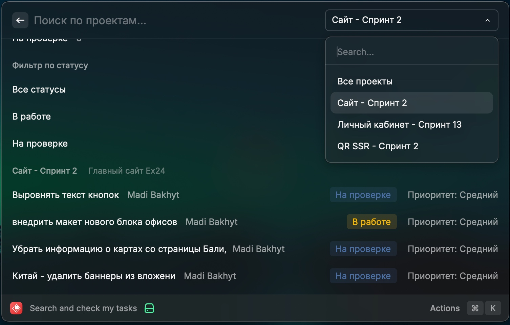
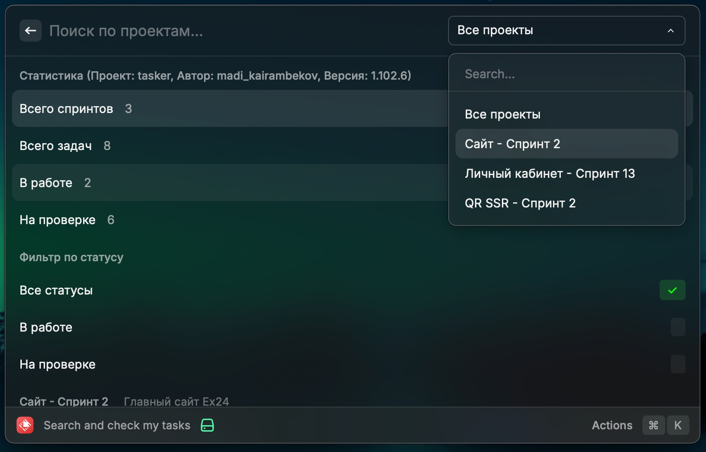

# 🚀 Tasker - Расширение для Raycast

> Удобное управление задачами прямо из Raycast


## 📋 Описание

**Tasker** - это расширение для [Raycast](https://raycast.com/), которое позволяет быстро просматривать и управлять вашими задачами. Расширение интегрируется с вашей системой управления задачами и предоставляет удобный интерфейс для работы с проектами и спринтами.

## ✨ Основные возможности

- 🔍 **Быстрый поиск** по проектам и задачам
- 📊 **Статистика** по проектам и задачам
- 🏷️ **Фильтрация** по статусам задач
- 📱 **Удобный интерфейс** в стиле Raycast
- ⚡ **Быстрый доступ** к задачам

## 🖼️ Скриншоты

### Главный экран


### Детальный просмотр


## 🚀 Установка

1. Установите [Raycast](https://raycast.com/)
2. Откройте Raycast и перейдите в **Extensions**
3. Найдите **Tasker** и установите расширение
4. Настройте ваш Bearer Token в настройках расширения

## ⚙️ Настройка

Для работы расширения необходимо настроить:

```typescript
PUBLIC_BEARER_TOKEN: "ваш_токен_авторизации"
```

## 🎯 Использование

1. **Откройте Raycast** и введите команду `Tasker`
2. **Просматривайте статистику** по вашим проектам
3. **Фильтруйте задачи** по статусам (В работе, На проверке, Готово)
4. **Выбирайте проекты** из выпадающего списка
5. **Открывайте задачи** в браузере для детального просмотра

## 🔧 Технические детали

- **Язык**: TypeScript
- **Фреймворк**: React
- **API**: Raycast Extensions API
- **Версия Raycast**: Поддерживается последняя версия

## 📁 Структура проекта

```
src/
├── search-and-check-my-tasks.tsx  # Основной компонент
├── types.ts                        # Типы данных
└── helpers.ts                      # Вспомогательные функции
```

## 🤝 Разработка

Для разработки и тестирования:

```bash
# Установка зависимостей
npm install

# Запуск в режиме разработки
npm run dev

# Сборка
npm run build
```

## 📝 Лицензия

Этот проект распространяется под лицензией MIT.

## 🙏 Благодарности

- [Raycast](https://raycast.com/) за отличную платформу для расширений
- Сообществу разработчиков Raycast за вдохновение

---

**Сделано с ❤️ для продуктивности**
